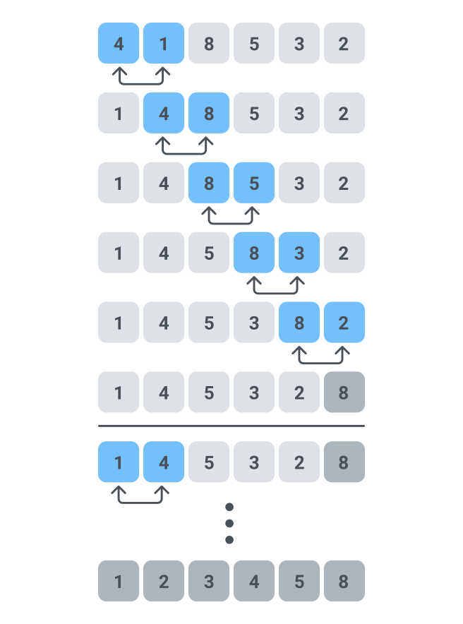

> 이 포스트는 제가 개인적으로 공부한 내용을 정리한 글입니다. 잘못된 내용이나 부족한 부분 등 자유로운 피드백은 저에게 큰 도움이 됩니다!

## 거품 정렬(Bubble Sort)

서로 인접한 두 원소를 검사하여 정렬하는 정렬 알고리즘이다.
시간 복잡도가 **O(N<sup>2</sup>)**로 다른 정렬 알고리즘에 비해 느리지만, 구현이 단순하다.



위에 이미지와 같이 버블 정렬은 `한 번의 순회`가 끝나면, 오름차순 기준 `가장 큰 수`가 **맨 마지막으로 위치하여 정렬이 완료된 것을 볼 수 있다.** 
`다음 순회` 때부터는 이미 맨 뒤에 가장 큰 수가 정렬되어 있어 **모든 원소를 검사할 필요가 없다.** 이렇게 버블 정렬은 한번 순회할 때마다 뒤에서부터 하나씩 정렬을 한다. 

위에 `6개의 원소`를 버블 정렬로 정렬하는 것을 보면 `맨 처음` 가장 큰 수 **8**을 정렬하는데 총 `5번의 검사`를 하게 된다.
`그다음` 큰 수인 **5**를 정렬할 때는 총 `4번의 검사`를 하게 된다. **이렇게 버블 정렬은 `정렬되지 않은 데이터의 길이 - 1`만큼 검사를 한다는 것을 알 수 있다.**


## 구현
```js
const arr = [4, 1, 8, 5, 3, 2]

function bubbleSort(arr) {
  for (let i = 0, l = arr.length; i < l - 1; i++) {
    // 이미 정렬된 데이터인지 확인하는 변수
    let isSwapped = false;
    // 정렬되지 않은 데이터의 길이 - 1 만큼 순회
    for (let j = 0; j < l - i - 1; j++) {
      if (arr[j] > arr[j + 1]) {
        // es6의 구조 분해 할당을 사용하면 간단하게 스왑할 수 있다.
        [arr[j], arr[j + 1]] = [arr[j + 1], arr[j]];
        // 스왑을 했기 때문에 이 데이터는 정렬되지 않은 데이터
        isSwapped = true;
      }
    }
    // 첫 순회 때 한 번이라도 스왑이 안되었다면 정렬된 데이터이므로 더는 순회할 필요가 없다.
    if (!isSwapped) break;
  }
  return arr;
}

console.log(bubbleSort(arr)); // log: [ 1, 2, 3, 4, 5, 8 ]
```