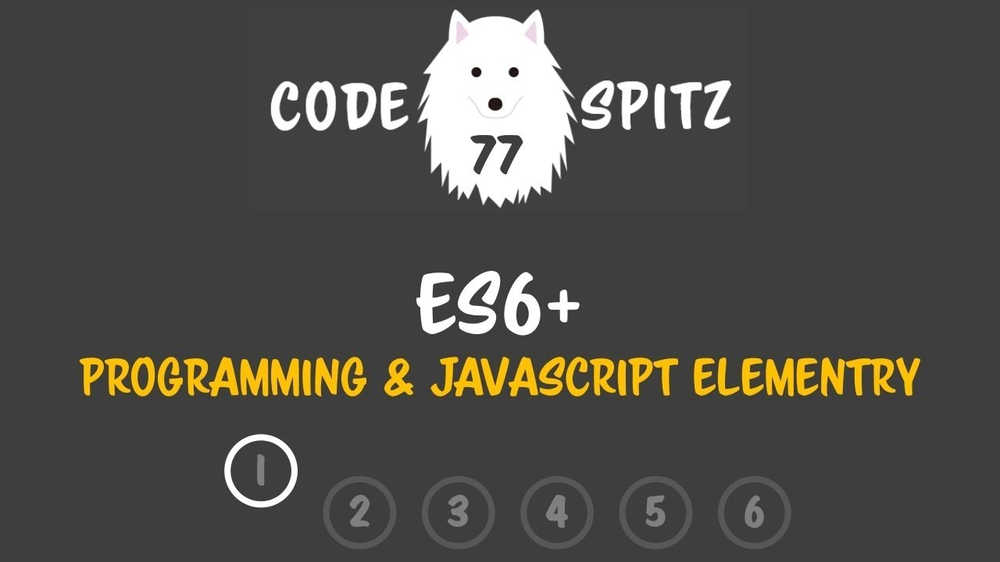
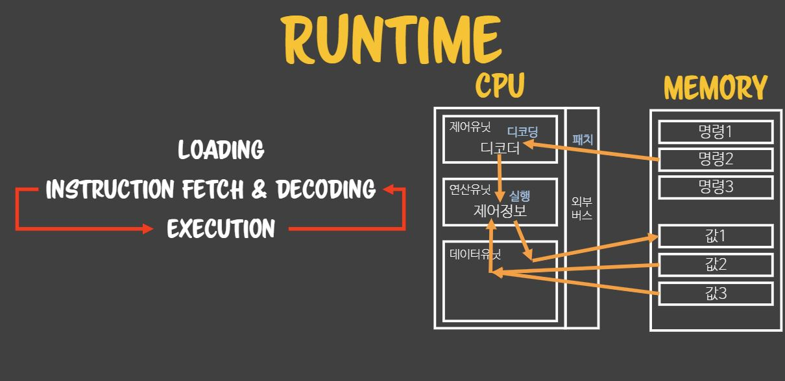
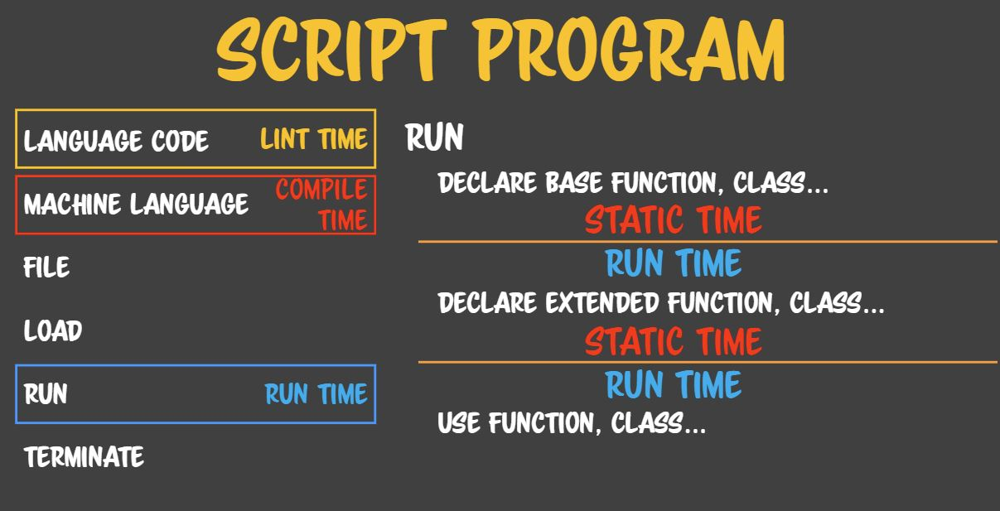

> 이 포스트는 [코드스피츠77 ES6+ 1회차](https://www.youtube.com/watch?v=0j_eGoF8Q98&list=PLBNdLLaRx_rIF3jAbhliedtfixePs5g2q&index=1)를 보고 개인적으로 정리한 내용입니다. 잘못된 내용이나 부족한 부분이 있으면 언제든 알려주세요. 😉



## 01. 너 대체 왜 그랬어?

### 개발의 기본

보통 학원들 다니면서 공부하면 바로바로 실무적인 지식이나 책에 있는 내용을 바로바로 주입하려고 한다.
하지만 그것들은 별로 중요하지 않다. 왜냐하면, 자바스크립트도 언젠가 다른 언어가 그러하듯이 다른 언어로 대체 되거나 없어진다.

지식은 한강 물처럼 흘러간다. 지식에 너무 집착하면 지식은 강물처럼 떠나가기 때문에 구태의연하게 붙잡고 있다 같이 떠내려갈 수 있다.  
ex) Objective-C -> Swift

지식 이전에 지식과 상관없이 변하지 않는 것은 프로그래밍에 대한 여러 가지 철학이나 방향성이라고 볼 수 있다. 이걸 정립하고 어떠한 언어에 대한 자세를 갖지 않으면 지식에만 휩쓸려 다니게 된다.  
ex) 앵귤러가 최고야, 자바가 최고야, php는 나빠 등 이런 말을 하는 사람

어떠한 언어나 지식을 배울 때 그 지식과 같이 떠내려가고 싶지 않다면 거기에 흔들리지 않는 철학적인 기반을 마련할 필요가 있다.

### 철학

근대철학 사조는 상대적이면서 합리적이다.  
jvm 입장에서 윈도우는 플랫폼이지만 자바 입장에서는 jvm이 플랫폼이다. 즉, 어느 한 프로그램을 어플리케이션 또는 플랫폼이라고 정의할 수 없다.

프로그램 전반적으로 상대적인 관점이 다 정의가 되어있기 때문에 굉장히 혼란스럽게 한다.
하나로 정의하고 불변했으면 좋겠지만, 상대주의 관점으로 바라보지 않으면 절대주의적인 함정에 빠지게 된다. 상대주의의 기준을 세울 때 합리주의가 동원되기 때문에 상대주의와 합리주의는 서로 상보완 관계이다.

### 기준 (가치, 원칙, 패턴)

프로그래밍을 왜 그렇게 짰는지에 대한 기본적인 가치관

#### 가치

가치는 정도에 따라서 사회 전체가 인정할 수도 있고 회사나 팀이나 친구밖에 인정 안 할 수도 있다. 따라서 가치라는 건 절대적인 게 아니라 소속된 집단별로 다중적으로 겹쳐서 나오게 된다.

- **의사소통**
  - 너 왜 그렇게 짰어? 이렇게 짜는 게 팀원들과 의사소통이 잘 돼요.
- **단순함**
  - 너 왜 그렇게 짰어? 그 전께 유지보수가 너무 힘들어서 단순한 구조로 바꿨어요.
- **유연함**
  - 너 왜 그렇게 짰어? 그 전 함수는 딱 그 케이스밖에 못쓰기 때문에 제가 다양한 레이어를 나눠서 다양한 케이스에 대응할 수 있도록 만들었어요.

#### 원칙

ex) 교장 선생님 훈화 말씀을 듣기 위해 뙤약볕 밑 운동장에 줄 맞춰 서 있는 것.

전원 열외 없이 줄 맞춰서 서 있다는 원칙을 지키고 있을 때 학생 한 명이 쓰러지면 이 학생이 원칙을 어겼거나 사고가 발생했다는 것을 즉시 알 수 있게 된다.  
원칙을 지키지 않고 어떤 학생은 앉아 있고, 어떤 학생은 누워 있는데 진짜로 아파서 쓰러지면 이 학생이 아파서 쓰러진 것인지 퍼져서 누운 것인지 바로 알 수 없다.  
즉, 원칙의 가치는 원칙을 정해 놓으면 원칙의 예외를 즉시 알 수 있다는 것에 있다.

원칙은 항상 지켜야 하기 때문에 많아지면 지키기 어렵다. 따라서 원칙을 정할 때는 중요한 것만 원칙을 정해야 하고 최소화시키는 것이 좋다.
가치보다 원칙을 정할 때 더 신중해야 한다.

- **지역화**
  - 전역변수 쓰지 말고 지역변수 쓰자.
  - 어떤 일을 만들 때 전체적으로 영향을 끼치게 하지 말고 국지적으로 영향을 끼치도록 만들어라
- **중복제거**
  - 중복되는 로직이 없게 해라.
  - 수정할 때 두 군데 동시에 수정하는 것이 어렵다.
  - 한번 구현은 되지만 수정, 유지보수, 두 번째 구현이 불가능해진다.
- **대칭성**
  - Get을 만들었으면 Set도 만들어라.
  - 쌍을 맞춰서 인터페이스를 맞춰라.
  - 쌍이 안 맞으면 충분한 힌트를 줘라.

#### 패턴

선배들의 경험이라고 할 수 있다.  
책상 위에 유리컵을 굴리면 몇 초 뒤에 떨어질 것인지 알 수 있다. 미래가 어떻게 될지 불확정적일 것 같지만 예상할 수 있는 일도 많다. 이처럼 프로그래밍의 여러 가지 상황에 대해 선배들이 미리 가본 길을 알 수 있다면 상황에 대한 이슈를 줄일 수 있다.  
프로그래밍 역사상 디버깅 비용이 줄어든 적이 없다. 선배들의 조언이 유용하다는 증거

- **개발론**
  - 함수형 함수지향 개발, 객체지향 개발, xx 지향 개발, 테스트 주도 개발 등
  - 개발론은 절대적인 진리가 아니다. 선배들이 해봤더니 이렇게 개발하면 되게 좋더라 이런 것
- **설계론**
  - 어떠한 설계 구조를 쓸 것인가? 3 Tier, 클라우드 모델 등
  - 전부 정답이 아니라 선배들의 경험이다. 경험도 반복되면 진리에 가까워진다.
- **각종 적용 패턴**

### 동기

- **돈**
- **시간**
  - 개발의 비용은 시간에서 발생한다.

## 02. PROGRAM & TIMING

### PROGRAM

1. **LANGUAGE CODE (LINT TIME)**
   - 우리가 알고 있는 프로그래밍 언어의 형태
   - `LINT TIME`에서 발생한 에러는 해결할 수 있다.
2. **MACHINE LANGUAGE (COMPILE TIME**)
   - 컴파일러가 기계 언어로 번역을 한 형태
   - `COMPILE TIME`에서 발생한 에러는 해결할 수 있다.
3. **FILE**
   - Java → class 파일, C → 바이너리 파일
4. **LOAD**
   - 파일이 컴퓨터 주 메모리에 올라가는 과정
   - 로드부터 프로그램이다.
   - 로드라는 행위 자체가 프로그램이 아니고 메모리에 적재된 것이 프로그램
   - 로드까지는 프로그래머의 영역
5. **RUN (RUN TIME)**
   - 실행
   - `RUN TIME`에서 발생한 에러는 재현도 힘들고 거의 해결이 불가능하다.
   - `RUN TIME`에서도 안 걸리는 에러를 **Context Error**라고 한다.
6. **TERMINATE**
   - 종료

### SCRIPT PROGRAM

스크립트 프로그램은 일반 프로그램과 달리 Machine Language가 4단계에 있다.

1. **LANGUAGE CODE (LINT TIME)**
   - 프로그램과 동일
2. **FILE**
   - 텍스트 파일
3. **LOAD**
   - 별도의 컴파일 없이 브라우저에 로드 (자바스크립트 기준)
4. **MACHINE LANGUAGE**
   - 로드가 끝나고 나서 기계어로 변환
5. **RUN (RUN TIME)**
   - 실행
6. **TERMINATE**
   - 종료

### RUNTIME

프로그램을 메모리에 적재하고 실행하는 것



1. **LOADING**
   - 메모리에 통째로 적재되는 것이 아니라 명령 부분과 데이터 부분을 나눠서 적재된다.
2. **INSTRUCTION FETCH & DECODING**
   - 외부 버스에 명령어가 들어오면 제어유닛에서 명령어를 디코딩한다.
3. **EXECUTION**
   - 연산유닛에서 데이터 유닛의 정보와 명령어를 가지고 실행(연산)한다.

**프로그램이 끝날 때 까지 2 ~ 3번을반복한다.**

### COMPILE PROGRAM FLOW


- **컴파일 타임은 런타임과 달리 명령어와 값들이 메모리에 로드된 상태가 아닌데 어떻게 검증을 하는 걸까?**
  - 컴파일러가 Language Code를 해석할 때 가상 메모리에 적재하고 실행하여 결과를 받는다.

1. **ESSENTIAL DEFINITION LOADING**
   - 가장 중요한 것부터 적재한다.
2. **V-TABLE MAPPING**
   - 가상 메모리와 진짜 메모리 맵핑
3. **RUN**
4. **RUNTIME DEFINITION LOADING**

   - 실행 중에 정의물을 만드는 것 ex) 자바스크립트에서 클릭으로 함수를 만드는 경우

### SCRIPT PROGRAM FLOW



- **컴파일 타임이 없고 런타임 중에 상대적인 기준으로 여러 단계로 구분되어 있다.**
- **현재의 단계를 런타임이라고 할 경우, 상위의 단계를 스태틱 타임이라고 한다.**

## 03. Memory, address, pointer, variables, dispatch

진짜 적재된 프로그램 안에서 무슨 일이 일어나는지 생각해보자.

**개발할 때 유연성을 위서 참조의 참조를 쓰는 데 왜 쓰는지가 핵심**  
**우리는 왜 직접 걔를 알지 않고 걔를 통해 다른 얘를 알려고 하는 거지?**

**Memory**  
메모리는 고유한 번호를 가지는 블록 체계로 되어 있다.  
블록을 나타내는 주소의 자릿수는 32bit, 64bit

**직접 참조가 왜 위험한지 알아보자.**

1. `A = "TEST"` A 변수의 주소가 11번이라고 가정해보자.
2. `&A = 11` C언어에서 `&변수`는 **변수의 주소**를 나타낸다.
3. `B = &A` B 변수에 A 변수의 주소를 할당
4. `*B = "TEST"` C언어에서 `*변수`는 포인터 변수로 가리키고 있는 **주소의 값**을 나타낸다.
5. `C = B, D = B...` 한번 변수를 만들면 변수는 퍼져나간다.
6. `B = &K` B 변수에 다시 K 변수의 주소를 할당

`B`가 `K`의 **주소를 할당** 받으면서 `C = B, D = B`에서 **모순점이 발생**한다. 코드상에는 분명히 `C, D`는 `B`와 같다고 명시되어 있고 변경된 것이 없다. 그러므로 코드를 읽는 사람은 `C, D`는 `B`와 같다고 생각할 수 있다. **하지만 `B`의 값이 바뀌었기 때문에 `C, D`는 `B`와 같지 않다.**

**이러한 문제를 어떻게 해결할까?**

- 함수형 패러다임에서는 참조 자체를 쓰지 말고 값만 사용하라고 한다.
- 객체지향에서는 직접 참조를 하지 말라고 한다.

**Double Dispatch**

```
B = { VALUE: &A, V: 3 }
C = B, D = B, ...
```

`B`가 `A`의 주소를 직접 참조하는 것이 아니라 참조의 참조를 하고 있다.
따라서 `A`의 주소를 얻으려면 참조의 참조를 통해서만 얻을 수 있다.  
`B.VALUE = &K`처럼 변경해도 변경된 것은 `B.VALUE`이므로 `C = B, D = B` 가 성립한다.  
주소로부터 값을 얻는 행위를 **dispatch**라고 한다.

## 04. LEXICAL GRAMMAR

- **CONTROL CHARACTER 제어문자**
  - 우리나라에는 없고 중동 계열에 있음
- **WHITE SPACE 공백문자**
- **LINE TERMINATORS 개행문자**
- **COMMENTS 개행문자**
- **KEYWORD 예약어**
- **LITERALS 리터럴**
  - 더 이상 나눌 수 없는 객체 또는 값의 표현

## 05. LANGUAGE ELEMENT

자바스크립트를 이루고 있는 요소. 아래 3가지 말고는 없음

- **STATEMENTS (문) : 공문, 식문, 제어문, 선언문, 단문, 중문**
  - 컴파일러 또는 실행기한테 주는 힌트이다.
  - 반복문, 제어문 등 문은 실행 결과를 남기지 않고 처리만 하고 사라진다. (메모리에 적재되지 않음)
  - 자바스크립트는 공문을 인정하기 때문에 `for(var i = 0; i < 5; i++);`해도 에러가 나지 않는다.
  - 중괄호는 중문에도 쓰이지만, 너무 많은 의미를 지니고 있다.
    - 중문, 객체 리터럴, 함수 리터럴, 클래스 리터럴 등 전부 다 다른 의미
- **EXPRESSION (식) : 값식, 연산식, 호출식**
  - 식의 결과는 언제나 하나의 값이 된다.
  - 자바스크립트는 식을 하나의 문(식문)으로 인정하기 때문에 `1;2;3;`해도 에러가 나지 않는다.
- **IDENTIFIER (식별자) : 기본형, 참조형, 변수, 상수**
  - 변수를 말한다. (변수가 아닌 식별자도 있다.)

## 06. FLOW

메모리에 적재된 명령어를 순서대로 소비하는 것을 말한다.

### SYNC FLOW

- 메모리에 적재된 명령어를 순서대로 소비하는 동안 **간섭을 못 한다**.

### FLOW CONTROL

- 제어문을 통해 SYNC FLOW를 제어한다.
- 순서대로 흐르는 SYNC FLOW를 제어를 하므로 흐름 제어라고 한다.

### SUB FLOW

- 흐름을 반복적으로 사용한다.
- 함수나 클래스를 이용한다.
