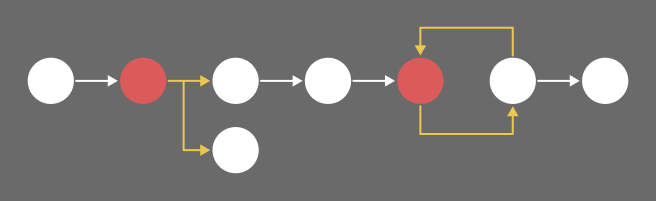

> 이 포스트는 [코드스피츠77 ES6+ 2회차 1/2](https://www.youtube.com/watch?v=FP9LBhPD4eo&list=PLBNdLLaRx_rIF3jAbhliedtfixePs5g2q&index=2) 를 보고 개인적으로 정리한 내용입니다. 잘못된 내용이나 부족한 부분이 있으면 언제든 알려주세요. 😉


## 01. RECORD, COMPLETION RECORD

### RECORD

자바스크립트는 문을 해석할 때 하나의 **실행단위**로 해석한다.  
식은 아무리 써봐야 값 하나로 수렴될 뿐인데, 문은 하나하나마다 처리해야 할 과제로 해석하기 때문에 문이 생길 때마다 과제로 등록을 해놓는다. 자바스크립트 엔진은 문을 작성하면 문 하나하나를 전부 다 **Record**라는 걸로 바꿔 저장하고 있다가 하나씩 소비한다.

자바스크립트 엔진이 우리가 짠 js파일을 파싱하고 나면 거기서 나오는 모든 문을 **Record 단위**로 파싱을 한다. 이렇게 하나하나 Record가 생기면 Flow를 타고 쭉 실행된다. **Record를 만들고 Record를 실행하는 과정이 자바스크립트 엔진의 주 작동원리라고 할 수 있다.**

> 인사이드 자바스크립트, 자바스크립트를 말하다와 같은 좋은 책들이 많지만 대부분 자바스크립트 3.1엔진을 기반으로 설명하고 있다. (옛날 책들) 현대의 모던 브라우저가 사용하고 있는 자바스크립트 엔진은 전혀 그렇게 움직이지 않는다. 스펙 문서 자체가 다르므로 자바스크립트 엔진이 동작하는 원리를 깊이 들어가는 글들을 참고해서 공부하지 마라. 자바스크립트는 해마다 엔진에 대한 스펙이 바뀌고 있으므로 지금의 동작 원리가 다음에는 다르게 동작할 수 있어 무의미하다.
> 기저층의 작동원리를 배우는 것보다 무엇을 의미하고 추상적인 의미가 무엇인지 체계를 배우는 것이 훨씬 낫다. 

### COMPLETION RECORD

자바스크립트 엔진은 우리가 작성한 문을 크게 **Record**와 **Completion record** 나눈다.  
분기 처리를 하는 `if`,  계속 flow를 돌릴 수 있는 `loop`과 같은 flow control statements는 record를 선택하거나 순환시킬 수 있는 권한을 가지게 된다. **이처럼 흐름 제어를 할 수 있는 문은 Completion record로 바뀌고 Completion record는 일반적으로 record를 뭘 선택할지 flow에 관여할 수 있다.**  

  

--- 

## 02. DIRECT FLOW CONTROL

맨 처음 언어는 직접 플로우 컨트롤하는 명령밖에 없었다. 우리가 쓰고 있는 언어들은 [ALGO60](https://ko.wikipedia.org/wiki/%EC%95%8C%EA%B3%A8_60)이라는 언어의 자손이라고 보고 있다. 앞 글자를 따서 일명 A언어라고 불린다. 이 ALGO60을 여러 가지 보완해서 나온 언어가 [B언어](https://ko.wikipedia.org/wiki/B_(%ED%94%84%EB%A1%9C%EA%B7%B8%EB%9E%98%EB%B0%8D_%EC%96%B8%EC%96%B4))이고 또 B언어를 보완해서 나온 것이 우리가 알고 있는 [C언어](https://ko.wikipedia.org/wiki/C_(%ED%94%84%EB%A1%9C%EA%B7%B8%EB%9E%98%EB%B0%8D_%EC%96%B8%EC%96%B4))이다.

ABC언어의 특징은 플로우 컨트롤을 하기 위한 별도의 문법을 제공하고 있다. `if`, `for`, `switch`,  `while`

### LABEL

**현재 자바스크립트에서 사용할 수 있는 Direct flow control이다.**
- 다중 for문을 썼을 때 바깥쪽 for문으로 빠져나오기 위해 `break`를 사용할 때 `label`이 필요하다.

```js
loop1: 
for (var i = 0; i < 3; i++) {
  loop2:
  for (var j = 0; j < 3; j++) { 
    if (i === 1 && j === 1) {
      break loop1;
    }
  }
}
// i === 1 && j === 1 일 때 loop1 label을 종료시킨다.
```

#### LABEL IDENTIFIER

 - `$`로 시작 및 포함할 수 없다. 그 외 자바스크립트 변수 규칙과 똑같다.
 -  식별자 뒤에 `:` 붙여주는 순간 `label`이 된다.
  
label은 문이 아니기 때문에 코드상에 label만 존재하면 에러가 발생한다.
label은 record 구조에 달아주는 일종의 태그다. 어떤 위치에 꼬리표를 달아주는 형식으로 들어가는 것이지 하나의 record로 번역되지 않는다. 그래서 label 자체만으로는 존재할 수 없다.

  ```js
  aaa:  // <- label만 있으면 에러 발생
  bbb:; // <- 실제 record로 번역되는 문만 있으면 label이 생성된다.
  ```

#### LABEL SCOPE

- 같은 scope 내에서는 동일한 식별자를 가진 label이 2개 이상 존재할 수 없다.
  - 런타임이 아닌 파싱 타임에서 확인한다. 에러를 사전에 알 수 있다.
- label의 스코프는 함수로 결정된다. 그래서 블록({})만으로는 label의 스코프를 막을 수 없다. 
  - 대신에 **label scope**라는 것을 만들 수 있다. 
  
  ```js
  aaa: {} // <- label 뒤에 바로 블록({})을 사용하면 label scope가 생성된다.
  bbb: {
    bbb:; // <- label scope 안에는 상위 label 식별자와 같은 label을 만들 수 있는데, 
          //    그러면 상위 label을 가리는 shadowing이 일어난다.
  }
  ```

- label scope가 존재하는 이유는 빠져나오기 위해서이다.
  ```js
  abc: {
    console.log('start')
    if (true) {
      break abc;
    }
    console.log('end')
  }
  // 출력: start
  ```
  
- `break` 문을 사용하여 break문 뒤에 명시된 식별자를 가진 label을 빠져나왔다.
  - 수동으로 flow 제어에 성공
  - 가장 원초적인 flow control이다.

#### LABEL RANGE & SET

- label range를 인식하려면 label set을 인식할 수 있어야 한다.  
- label은 어떻게 label 영역을 확보할까?
  - label에서 특별한 선언이 없는 경우, 다음 label까지가 영역이다.
  - iteration 및 switch가 오면 얘네들이 다시 label 범위를 한정 짓는다.
    ```js 
    console.log(0)
    abc:
    if(true) {
      break abc;
    }
    console.log(1)
    bbb:
    console.log(2)
   
    // 출력: 0 1 2
    ```
     - abc label의 range 영역이 확보됐지만, break 구문이 동작하지 않았다.
     - 건너뛰려면 label scope, iteration label, switch label이어야 한다.
     - goto는 안되고 break, continue로 아래로 내려가는 것만 가능하다. 

#### AUTO LABEL

- `braek`문은 반드시 뒤에 label 이름을 붙여줘야 하는데 `while`문, `for`문, `switch`문는 어떻게 그냥 쓸 수 있을까?
```js
for (var i = 0; i < 10; i++) {
  if (i == 5) break;
}
console.log('end')

// i == 5일 때, for문을 빠져나온다는 걸 알고 있다.
```

- `iteration(for, while)`, `switch`에 label 이름이 없는 경우 자바스크립트 엔진이 자동으로 label 이름을 삽입한다.
 ```js
temp38: // 자바스크립트 엔진이 레이블 이름을 삽입
for (var i = 0; i < 10; i++) {
 if (i == 5) break temp38;// 자바스크립트 엔진이 레이블 이름을 삽입
}
console.log('end')
```
- 이렇게 **auto label**이 만들어 낸 이름을 **undefined named label**이라고 한다.

> 레이블을 앞 주석으로 사용하는 예도 있다.
> ```js
> abc: console.log('abc')
> cba: console.log('cba')
> ```

#### ABC언어의 유일한 예외

  - 반복문 같은 경우, 반복할 때 반복문 맨 첫 부분으로 이동하여 반복을 시작한다.
  - 함수 같은 경우, 호출하면 함수 첫 부분으로 이동하여 함수를 실행한다.
  - **하지만 label의 break 같은 경우, label 맨 마지막으로 이동한다.**

> 자바스크립트의 label은 자바의 label 스펙과 동일하다.


## 02. SWITCH

- `switch`문은 어떻게 이루어져 있나?
  1. `switch`라는 키워드가 나온다.
  2. 그다음 괄호가 나오고 괄호 안에 식이 들어간다.
  3. 그다음 중괄호가 나온다.
- `switch`문의 중괄호는 문법적인 토큰이다.
  - `for`문 같은 경우, 괄호 다음으로 단문과 중문이 나올 수 있지만 `switch`문은 불가능하다.
    ```js
    for (var i = 0; i < 10; i++); // 가능
    switch (true);                // Uncaught SyntaxError: Unexpected token ';'
    ```
   - `swtich`문의 중괄호는 중문 또는 함수의 몸체가 아닌 오로지 `switch`문의 몸체를 나타내는 전용 토큰이다.

### SPECIAL LABEL BLOCK
`switch`문의 중괄호는 **special label**이 가능한 공간이다. `switch`문의 **special label**은 `case 식:`, `default:`와 같은 레이블을 만들 수 있게 해주는 특수한 레이블 공간이다. **따라서 `switch`문이라는 건 특별한 레이블을 영역을 선언할 수 있는 공간을 만들어 줄 수 있는 문법이라고 할 수 있다.**

- 지금까지 배웠던 레이블과 완전히 일치한다. 
- 단지 레이블을 컴파일 타임에 해석되는 정적인 레이블을 만든 것이 아니라 `case` 안에 있는 식을 동적으로 해석할 수 있는 특수한 레이블 만든 것이다. 
- `switch` 괄호 안에 있는 값을 runtime에 평가해서 `case` 안에 있는 값과 일치하는 레이블로 보낼 수 있는 특수한 레이블 구문을 만들어주는 것이 `switch`문이다.

### FALL THROUGH
`case` 뒤에 `break`가 없으면 그 밑으로 쭉 실행되는 현상
  
- `case`는 `switch`문의 특별한 레이블일 뿐, 동작하는 것은 일반 레이블과 다를 게 없다. 
  - 따라서 `break`가 없으면 밑으로 쭉 실행되는 것은 당연하다.
- `break`를 걸면, `switch`문의 **undefined named label**을 빠져나온다.

```js
// switch문의 auto label
temp17: // undefined named label
switch(1) {
  default: console.log('default');
  case 1: console.log('case1'); break temp17; // undefined named label
  case 2: console.log('case2');
}

console.log('end');

// 출력: case1 end
```

### RUNTIME SWITCH

자바스크립트의 `case`문은 runtime에 해석한다. runtime에 해석하는 기능 때문에 자바스크립트의 `switch`문을 2가지 방식으로 쓸 수 있게 해준다.

1. 값에 대한 routing으로 쓸 수 있다.
2. 조건 평가에 대한 분기로 쓸 수 있다.

- 우선순위는 값에 대한 routing이 정적일 경우 값에 대한 routing이 더 유리하다. 우리가 흔히 알고 있는 `switch`구문이 값에 대한 라우팅이다.

```js
// 1. 값애 대한 routing (우리가 흔히 알고 있는 것)
// mini routing table 패턴 
var a = true;
switch (a) {
  case true: console.log('a'); break;
  case false: console.log('b'); break;
}

// 2. 조건 평가에 대한 분기
// chainable responsibility 패턴
switch (true) {
  case network() === "online": 
  case network() === "wifi":
  case network() === "offline":
  case localCache(): 
  default: // 안내문...
}
```


>사람들마다 기초 구문에 대한 이해의 폭이 다 다르다. 다양한 오픈 소스를 보며 어떤 사람은 기초 구문을 굉장히 빠삭하게 알아서 "스펙이 이렇기 때문에 동작하겠구나."라고 생각하며 코드를 작성하는 사람이 있고, 어떤 사람은 기초 구문을 얕게 알기 때문에 굉장히 긴 코드로 작성하는 사람도 있다. 사람은 자기 눈으로 세상을 보기 때문에 "이 사람은 암호 같은 코드를 짰어." 이렇게 욕하는 사람이 있는가 하면 "이 사람은 문법을 굉장히 잘 아네"라고 보는 사람이 있다.  
>눈을 넓게 보자. 어떠한 문법적인 요소가 암호로 보이면 걔가 이상한 사파의 스킬을 쓰는 게 아니라 브라우저에 돌아가는 이상 스펙 문서에 있는 내용이다. 그러한 언어의 스킬을 사용하는 것을 "얘는 이상한 코드로 짜."라고 보지 말자. 문법의 어떠한 기능이 있는지 생각을 해보고 부정적으로 보지 말자.

`switch`문이 runtime에 해석된다는 말은 위에서부터 아래로 한 줄씩 순차적으로 실행한다는 뜻이다.
```js
var a = 2;
switch (true) {
  case a++ > 5: console.log(a); break;
  case a++ > 5: console.log(a); break;
  case a++ > 5: console.log(a); break;
  case a++ > 5: console.log(a); break;
  case a++ > 5: console.log(a); break;
  case a++ > 5: console.log(a); break;
}
// 출력: 7 순차적으로 실행되기 때문에 증감 연산자가 다음 줄에 영향을 준다.
```
순차적으로 실행이 되기 때문에 `case`문에 함수를 호출하게 되면 함수에 대한 여파가 다음 줄에 영향을 줄 수 있다. 따라서 `switch`문을 router로 사용하지 않거나, router로 사용하더라도 함수가 개입하거나 증감 연산자와 같은 상태를 바꾸는 것들이 들어가면 항상 주의해서 써야 한다.

- 이러한 문제가 runtime에서 `switch`를 해석하는 모든 언어에서 발생한다.