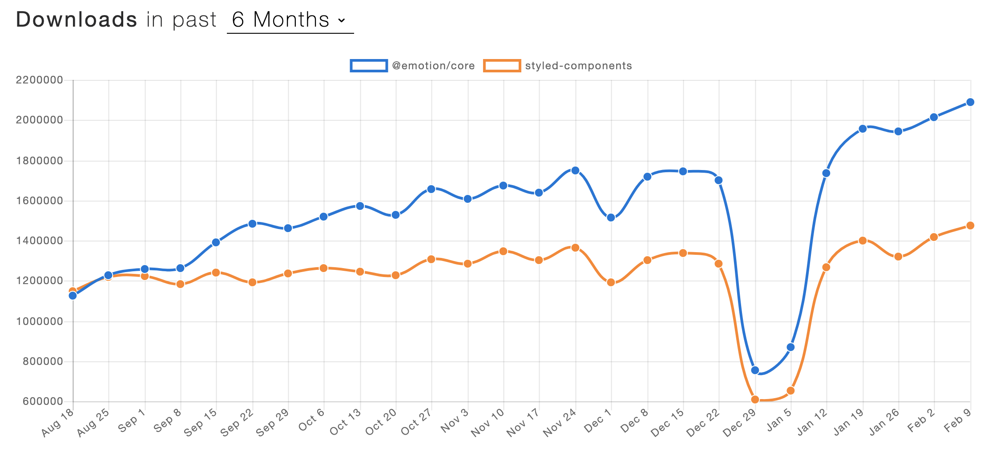

## 블로그를 시작하게 된 이유

따로 거창한 이유는 없고 프로그래밍 공부를 하면서 접하는 여러 기술 블로그들을 보며 저도 후에 블로그를 한번 해보자는 목표가 생겼습니다. 그렇게 기약 없는 목표만 가지고 있다가 [개발자가 블로그를 운영해야 할 이유](https://taegon.kim/archives/7107)라는 포스트를 읽고 바로 시작하게 되었습니다. 블로그는 자신의 생각이나 정보를 글로 정리 및 공유하는 곳이니 저의 부족한 부분을 채워줄 뿐만 아니라 큰 도움이 될 것이라고 생각합니다.

## 블로그를 만들게 된 이유
처음에는 좋은 블로그 플랫폼들이 많아 플랫폼을 이용하려고 했었는데 지금까지 공부하면서 예제들만 따라 만들어 봤지 혼자 무엇을 만들어 본 적이 없어 이번에 블로그를 한번 만들어보자 마음먹어 만들게 되었습니다.

## TAEKLOG
TAEKLOG는 [Gatsby](https://www.gatsbyjs.org/)와 [Netlify](https://www.netlify.com/)로 만들었습니다. 
블로그 이름은 저의 이름 맨 끝 자를 따서 **TAEKLOG**로 지었습니다.

### 템플릿
템플릿은 [Gatsby starters](https://www.gatsbyjs.org/starters/?v=2)에서 제일 인기 많은 [gatsby-starter-blog](https://github.com/gatsbyjs/gatsby-starter-blog)를 사용했습니다.

### 스타일

CSS in JS인 [emotion](https://emotion.sh/docs/introduction)을 사용했습니다. emotion은 [styled-components](https://styled-components.com/)보다 파일 사이즈가 더 작고 [다운로드 수](https://www.npmtrends.com/@emotion/core-vs-styled-components)도 styled-components보다 높습니다.
emotion을 사용하게 된 이유는 [velopert님](https://velopert.com/)의 스토리북 오프라인 강의 때 한번 사용해 본 경험이 있고 또 따로 스타일 컴포넌트틀 만들지 않고  바로 [css-props](https://emotion.sh/docs/css-prop)로 스타일 설정하는 것이 편리하여 사용하게 되었습니다.
 
### 카테고리

카테고리와 태그입니다. 태그를 서브 카테고리 식으로 사용하기 위해 다른 카테고리의 태그와 중복이 안되게 만들었습니다. 태그의 스와이프는 [Swipter.js](https://swiperjs.com/)를 사용하여 구현했고 사용자가 접었다 폈다 할 수 있게 드롭 다운 형태로 만들었습니다.  카테고리 및 태그 설정 시 세션 스토리지에 저장하여 페이지가 새로 고침 될 경우 설정한 카테고리가 유지되게 만들었습니다.
 
### 다크 테마

다크 테마는 요즘 웹디자인 트렌드 중 하나라고 합니다. 저 또한 트렌드에 뒤쳐지고 싶지 않아 다크 테마를 적용했습니다. 개인적으로 아이폰과 유튜브의 다크 모드를 잘 사용하고 있어서 꼭 만들어 보고 싶은 기능이었습니다. 
테마 설정 시 로컬 스토리지에 변경된 테마를 저장하고 새로 고침 및 후에 블로그에 들어올 시 로컬 스토리지에 있는 테마 값으로 테마를 설정합니다. 디폴트 값으로 라이트 테마를 사용합니다.
 
### 포스트 생성 cli

저만 사용하는 블로그지만 조금이라도 생상성을 높이기 위해 포스트를 생성하는 cli를 만들어 봤습니다. 처음으로 cli를 만들어 봤는데 생각보다 재밌게 만들었습니다. 결과물은 어설프지만 생각보다 편해서 마음에 듭니다.

## 후기
이번 블로그를 만들면서 처음으로 직접 만들어봤다는 것에 정말 큰 성취감과 자신감을 얻었습니다. 또 만들면서 저의 부족한 부분을 다시 한번 더 깨닫게 되었고, 개발에 더욱더 재미를 느끼게 되었습니다. 이번 블로그를 만들면서 많은 개발자분의 코드를 참고하였는데 정말 큰 배움이 되었습니다. 그런 분들과 같이 일하는 날이 올 수 있게 더욱더 노력해야겠습니다.