> 저의 Mac 초기 설정을 정리한 글입니다.  
> 설치가 필요한 경우 가능한 **homebrew**로 설치하는 방식으로 소개하고 있습니다.
****

## Mac 기본 설정

- `Dock` 아이콘 전부 제거
- `Launcpad` 기본앱 정리하기
- `Finder` &rarr; 보기 &rarr; 경로 막대 보기

### 시스템 환경설정

- `Dock 및 메뉴 막대` &rarr; 자동으로 Dock 가리기와 보기  [x]
- `Dock 및 메뉴 막대` &rarr; Dock에서 최근 사용한 응용 프로그램 보기 [ ]
- `Mission control` &rarr; Space 최근 사용 내역 자동 재정렬 [ ]
- `손쉬운 사용` &rarr; `포인터 제어기` &rarr; `트랙패드 옵션` &rarr; `드래그 활성화`[x] &rarr; 세 손가락 드래그하기  **(추천)**
  - 드래그할 때 힘들게 꾹 누를 필요 없이 세 손가락으로 드래그할 수 있습니다.
- `키보드` &rarr; `키보드` &rarr; 🌐 눌러 다음 실행 \[동작 없음\]
- `키보드` &rarr; `키보드` &rarr; F1, F2 등의 표준 기능 키로 사용 [x]
- `키보드` &rarr; `단축키` &rarr; `Spotlight` &rarr; Spotlight 검색 \[잘 사용 안하는 단축키로 변경\]
- `키보드` &rarr; `단축키` &rarr; `Spotlight` &rarr; Finder 검색 윈도우 \[사용안함\]
- `키보드` &rarr; `입력 소스` &rarr;  한/A 키로 ABC 입력 소스 전환 [ ]
  - 저는 한/A을 control로 바꿔 사용하고 있습니다.
- `배터리` &rarr; `배터리`, `전원 어댑터` &rarr; `디스플레이 끄기` [안함 or 3시간]

## Homebrew

[Homebrew](https://brew.sh/index_ko)는 명령어로 라이브러리, 소프트웨어 등을 복잡한 과정 없이 설치, 업데이트, 삭제 등의 관리를 손쉽게 할 수 있는 macOS 패키지 관리자입니다. macOS 로컬 개발 환경을 설정하는 데 필요한 필수 도구입니다.

### 설치

#### 01. Xcode Command Line tools 설치 

```bash
$ xcode-select --install
```

#### 02. Homebrew 설치

```bash
$ /bin/bash -c "$(curl -fsSL https://raw.githubusercontent.com/Homebrew/install/HEAD/install.sh)"
```

#### 03. PATH 추가

설치가 완료되면 마지막에 다음과 같은 메시지가 나옵니다.

```bash
==> Next steps:
- Add Homebrew to your PATH in /Users/<USER_ID>/.zprofile:
    echo 'eval "$(/opt/homebrew/bin/brew shellenv)"' >> /Users/<USER_ID>/.zprofile
    eval "$(/opt/homebrew/bin/brew shellenv)"
- Run `brew help` to get started
- Further documentation:
    https://docs.brew.sh

```

다음 코드를 터미널에 입력합니다.

```bash
$ echo 'eval "$(/opt/homebrew/bin/brew shellenv)"' >> /Users/<USER_ID>/.zprofile
$ eval "$(/opt/homebrew/bin/brew shellenv)"
```

## iTerm2

[iTerm2](https://iterm2.com/downloads.html)는 분할 창, 검색, 다양한 설정 등 기본 터미널보다 다양한 기능을 제공하는 터미널 앱입니다. 저는 MacOS의 기본 터미널 대신 iTerm2를 사용하고 있습니다.

### 설치

```bash
$ brew install --cask iterm2
```

### 커스터마이징

- `Preferences` &rarr; `Appearence` &rarr; `Theme` &rarr; Minimal 선택

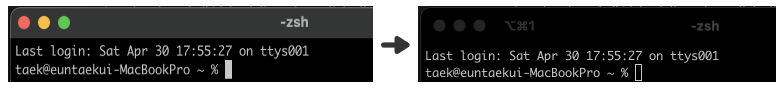

- `Preferences` &rarr; `Profiles` &rarr; `Colors` &rarr; 원하는 `color` 또는 `scheme` 설정

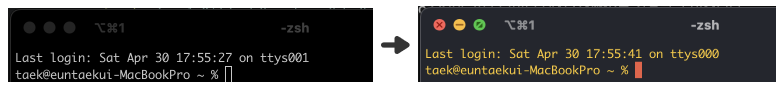

- `Preferences` &rarr; `Profiles` &rarr; `Windows` &rarr; `Transparency`, `Blur` 설정

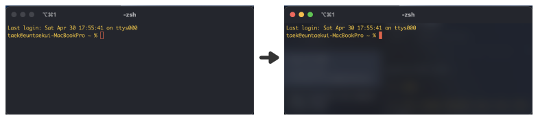

- `Preferences` &rarr; `Profiles` &rarr; `Session` &rarr; Status bar eneabled [x]

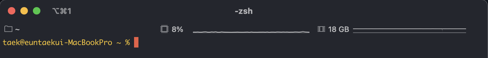

### cmd/option + arrow 사용하기

기본적으로 iTerm2에서는 단어 단위 이동(option + arrow), 맨 처음, 맨 끝 이동(cmd + arrow) 등이 동작하지 않습니다. 아래와 같이 설정하면 cmd/option + arrow 사용할 수 있습니다.

- `Preferences` &rarr; `Profiles` &rarr; `Keys` &rarr; `Key Mappings` &rarr; `Presets` &rarr; Natural Text Editing 선택

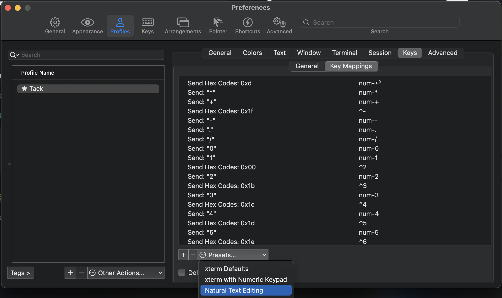
## Oh My Zsh

> macOS ‘카탈리나’부터 기본 쉘이 bash에서 zsh로 변경되었습니다.

[Oh My Zsh](https://ohmyz.sh/)는 zsh 구성을 관리할 수 있는 프레임워크로 수많은 플러그인과 테마를 지원합니다.

### 설치

```bash
$ sh -c "$(curl -fsSL https://raw.github.com/robbyrussell/oh-my-zsh/master/tools/install.sh)"
```

설치가 완료되면 아래와 같은 메시지가 나옵니다.

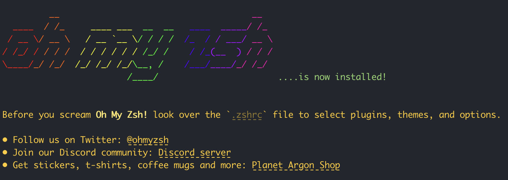

## zsh 플러그인

제가 사용하고 있는 zsh 플러그인입니다. 


### zsh-autosuggestions

[zsh-autosuggestions](https://github.com/zsh-users/zsh-autosuggestions)는 명령어를 입력할 때 히스토리 기반으로 명령어를 제안하는 플러그인입니다.

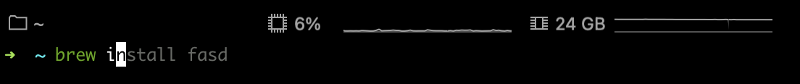
 
####  설치

```bash
$ brew install zsh-autosuggestions
```

`.zshrc` 맨 아래에 다음 코드를 추가합니다.

```bash
source /opt/homebrew/share/zsh-autosuggestions/zsh-autosuggestions.zsh
```


### zsh-syntax-highlighting

[zsh-syntax-highlighting](https://github.com/zsh-users/zsh-syntax-highlighting)은 쉘에 대한 구문 강조 표시를 제공하는 플러그인입니다.

- 사용할 수 있는 명령어

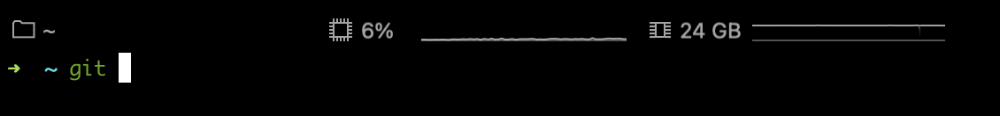

- 사용할 수 없는 명령어

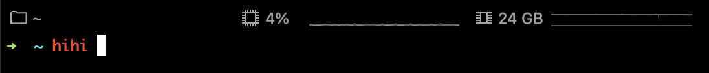

#### 설치

```bash
$ brew install zsh-syntax-highlighting
```

`.zshrc` 맨 아래에 다음 코드를 추가합니다.

```bash
source /opt/homebrew/share/zsh-syntax-highlighting/zsh-syntax-highlighting.zsh
```


### fasd

[fasd](https://github.com/clvv/fasd)는 명령줄 생산성 향상 플러그인입니다.  

파일 및 디렉토리에 대한 빠른 액세스를 제공합니다. 많은 기능을 제공하지만 저는 주로 `z` 명령어를 제일 많이 사용합니다. `z` 명령어는 가장 많이 접근한 디렉토리 또는 입력된 텍스트와 매칭되는 디렉토리 이동합니다.

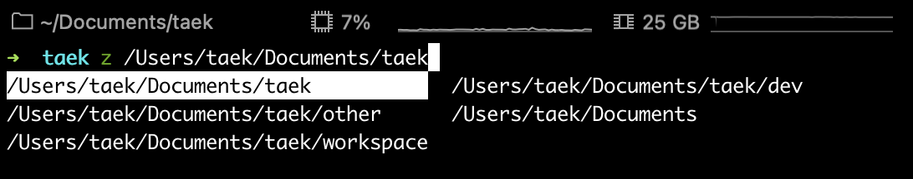

#### 설치

```bash:cli
$ brew install fasd
```

`.zshrc` 플러그인에 `fasd`를 추가합니다.

```bash
...
plugins=(
  git
  fasd  # <- 추가
)
...
```


### jq

[jq](https://stedolan.github.io/jq/)는 JSON 프로세서입니다. 

JSON 포맷의 데이터를 커맨드라인에서  필요한 정보를 추출하고 편집하는 등의 작업을 간단하게 수행할 수 있는 기능을 제공합니다. 저는 사용하는 경우가 드물지만, 가끔 커맨드라인에서 JSON 데이터를 보는 경우 사용합니다. 

- JSON 데이터 출력

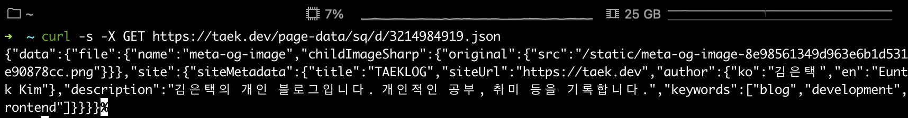
- `jq`를 사용하여 JSON 데이터 출력

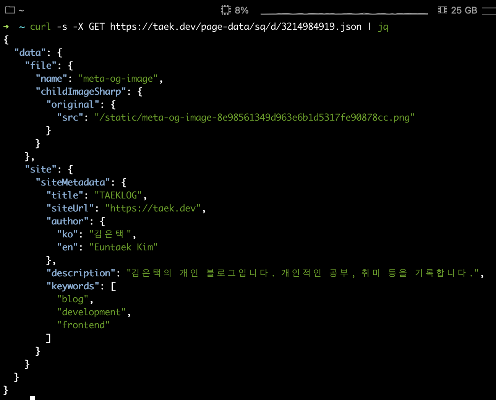

#### 설치

```bash
$ brew install jq
```

### bat

[bat](https://github.com/sharkdp/bat)은 파일 내용을 출력하는 플러그인입니다  

구문 강조, 깃 통합 등 다양한 기능이 있어 기본 명령어 `cat` 대체해서 사용하기 좋습니다.

- `cat`

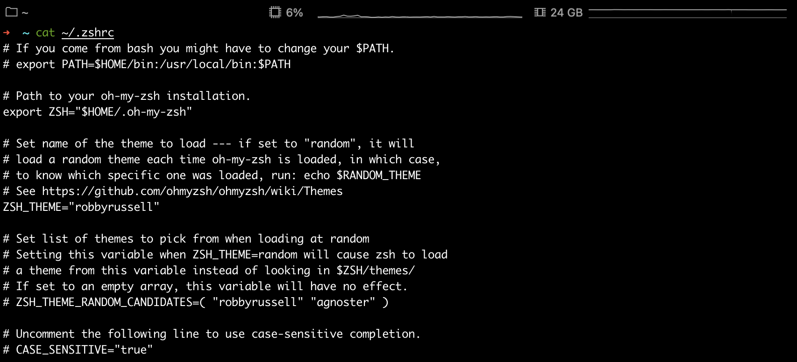

- `bat`

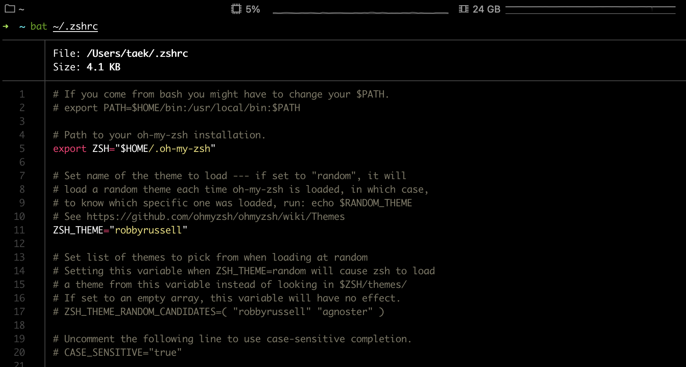
#### 설치

```bash
$ brew install bat
```


## powerlevel10k

[powerlevel10k](https://github.com/romkatv/powerlevel10k)는 zsh 쉘 프롬프트입니다.  

대부분 기능이 비동기로 작동하기 때문에 속도가 굉장히 빠릅니다. 다른 프롬프트를 사용하면서 로딩이 오래 걸렸던 경험이 있으면 사용해보세요.

### 설치

```bash
$ brew install powerlevel10k
```

설치 후 안내 메시지에 따라 `.zshrc`에 다음 코드를 추가합니다.

```bash
# ZSH_THEME="robbyrussell" <- 기존 테마는 주석처리 해주세요.
# powerlevel10k theme
source /opt/homebrew/opt/powerlevel10k/powerlevel10k.zsh-theme
```

`source ~/.zshrc` 또는 터미널을 재시작하면 설정 안내 메시지가 나옵니다. 입맛에 맞게 설정하시면 됩니다.

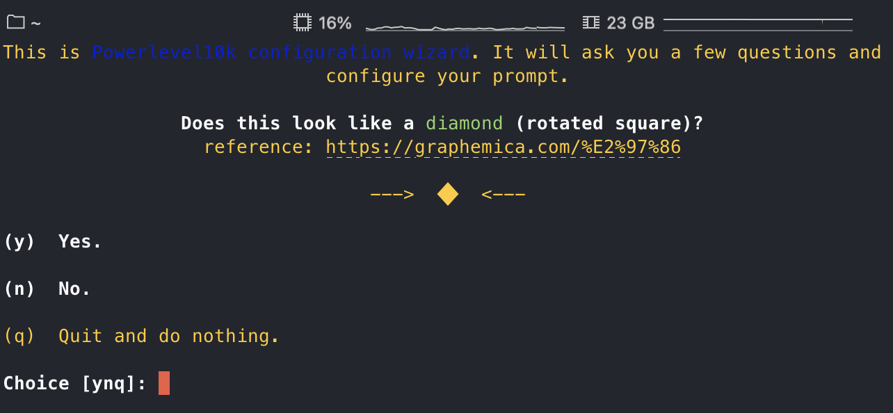

## Karabiner

[Karabiner](https://karabiner-elements.pqrs.org/)는 macOS 키보드 커스터마이징을 손쉽게 할 수 있는 유틸리티 앱입니다. 


### 설치

```bash
$ brew install --cask karabiner-elements
```
### Simple modifications

특정 키 입력을 다른 키 입력으로 바꿀 수 있습니다.

#### caps lock을 control로 사용하기

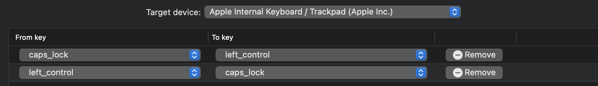

### Complex modifications

저는 karabiner의 Complex modifications를 사용하여 몇 가지 키 조합을 사용하고 있습니다. [complex rule 생성하기](https://genesy.github.io/karabiner-complex-rules-generator/)를 통해 rule을 생성할 수 있습니다.

#### **right_command + hjkl**으로 방향키 사용하기
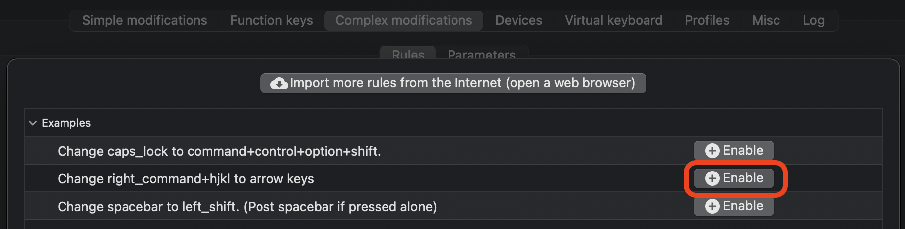

#### **right_command + tab**으로 **caps lock** 사용하기

```json
// rule
{
  "description": "right_command + tab to caps_lock",
  "manipulators": [
    {
      "from": {
        "key_code": "tab",
        "modifiers": {
          "mandatory": [
            "right_command"
          ],
          "optional": [
            "any"
          ]
        }
      },
      "to": [
        {
          "key_code": "caps_lock"
        }
      ],
      "type": "basic"
    }
  ]
}
```
  
 #### **right_command + backspace**으로 **delete forward** 사용하기
 
```json
// rule
{
  "description": "right_command + backspace to delete_forword",
  "manipulators": [
    {
      "from": {
        "key_code": "delete_or_backspace",
        "modifiers": {
          "mandatory": [
            "right_command"
          ],
          "optional": [
            "any"
          ]
        }
      },
      "to": [
        {
          "key_code": "delete_forward"
        }
      ],
      "type": "basic"
    }
  ]
}
```


## Git
macOS는 기본적으로 git이 설치되어 있지만 최신버전을 사용하기 위해 설치합니다.

### 설치

```bash
$ brew install git
$ git --version
```


## nvm

[nvm](https://github.com/nvm-sh/nvm)은 node.js 버전 매니저입니다.  

여러 node.js 버전을 손쉽게 관리할 수 있는 도구입니다. 

### 설치

```bash
$ brew install nvm
```
```bash
$ mkdir ~/.nvm # <- nvm 폴더 생성
```

`.zshrc` 맨 아래에  PATH 추가

```bash
# PATH는 다 다를 수 있으니 nvm 설치 후 나오는 안내 메시지를 참고하세요.
export NVM_DIR="$HOME/.nvm"
[ -s "/opt/homebrew/opt/nvm/nvm.sh" ] && \. "/opt/homebrew/opt/nvm/nvm.sh"  # This loads nvm
[ -s "/opt/homebrew/opt/nvm/etc/bash_completion.d/nvm" ] && \. "/opt/homebrew/opt/nvm/etc/bash_completion.d/nvm"  # This loads nvm bash_completion
```

node.js 설치 및 사용  

```bash
$ nvm ls=remote --lts      # <- 설치 가능한 node.js LTS 버전 원격 목록 확인
$ nvm install node --lts   # <- node.js LTS 최신 버전 설치
$ nvm use --lts            # <- node.js LST 최신 버전 사용

$ nvm ls                   # <- 설치된 node.js 목록 확인
$ npm -v                   # <- npm 버전 확인
```

저는 v16 LTS(최신), v17.9.0 이렇게 사용하고 있습니다. 


## Yarn

[Yarn](https://yarnpkg.com/)은 node.js 패키지 매니저입니다.  

### 설치

node.js v16.10 이상 버전부터는 [Corepack](https://nodejs.org/dist/latest/docs/api/corepack.html)이라는 패키지 관리자 버전을 관리하는 도구가 포함되어 있습니다. Corepack을 사용하면 Yarn을 사용할 수 있습니다.

> node.js v16.10 미만 버전는 `npm i -g yarn` 으로 설치할 수 있습니다.

```bash
$ corepack enable          # <- corepack 활성화

$ yarn -v                  # <- yarn 버전 확인
$ yarn set version stable  # <- yarn 최신버전 업데이트
```

yarn global 설정하기

```bash
$ yarn global bin        # <- yarn global bin 경로 확인
$ yarn config get prefix # <- yarn 접두사 확인

# yarn global bin 경로에서 bin 상위 디렉토리 경로를 접두사 설정 ex) /Users/username/.yarn
$ yarn config set prefix [yarn global path] # <- yarn 접두사 설정 
```

## Alfred 
[Alfred](https://www.alfredapp.com/)는 macOS용 생산성 앱입니다.  

macOS의 Spotlight와 유사한데 훨씬 많은 기능을 제공하고 있습니다. 잘 사용하면 엄청난 생산성을 제공해 주지만, 저는 주로 파일 실행 및 찾기, 맞춤법 검사, 네이버/구글 검색, 네이버 영어사전, 구글 번역 등 간단하게 사용하고 있습니다. 참고로 파워팩(라이선스)을 구매해야 모든 기능을 사용할 수 있습니다. 제가 사용하는 정도로는 무료로 가능할지도 모르겠습니다. 저는 돈값 못하게 사용하는 중입니다.

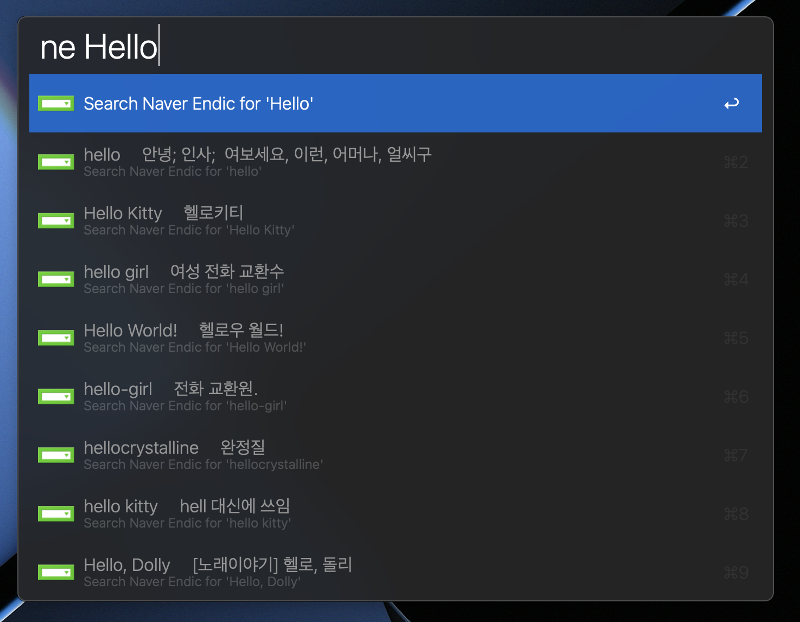

### 설치

```bash
$ brew install --cask alfred
```

설치 후 입 맛에 맞게 설정하세요. 

## Fig

[Fig](https://fig.io/)는 기존 터미널에 IDE 스타일의 자동 완성을 제공하고 커스텀할 수 있는 유틸리티 앱입니다. 

zsh-autosuggestions와 비슷하지만, fig는 네트워크 요청을 통해 완성 스펙를 가져오기 때문에 훨씬 다양하고 영리한 자동 완성을 제공해줍니다. 앱 첫 로드 시 CDN에서 완성 스펙을 가져오고 로컬에서 동작합니다. 때때로 필요할 때 네트워크 요청을 합니다. 

> Fig는 몇 가지 정보를 수집한다고 합니다. 사용하시기 전에 [Fig Privacy](https://fig.io/privacy)를 확인하시기 바랍니다.

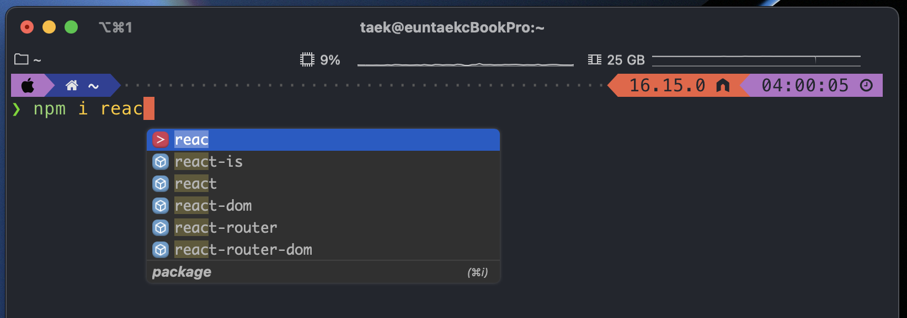

### 설치

```bash
$ brew install --cask fig
```

## OpeninTerminal-Lite, OpeninEditor-Lite

[OpeninTerminal-Lite, OpeninEditor-Lite](https://github.com/Ji4n1ng/OpenInTerminal)는 Finder의 현재 디렉토리 위치에서 터미널 및 편집기를 바로 열 수 있는 유틸리티 앱입니다.

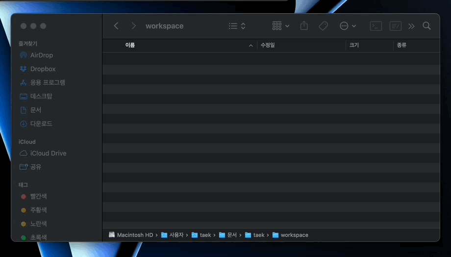


## Visual Studio Code, Chrome

저는 개발할 때 vsocde를 사용하고 있고 크롬 웹 브라우저 사용하고 있습니다.

```bash
$ brew install --cask visual-studio-code
$ brew install --cask google-chrome
```

## 개인적으로 추천하는 앱

### BetterTouchTool \(유료\)

[BetterTouchTool](https://folivora.ai/)는 단축키, 트랙패드, 마우스 등 각종 커스터마이징을 지원하는 유틸리티 앱입니다. 저는 주로 단축키 앱 실행과 트랙패드 제스처 기능을 사용하고 있습니다.

### Margnet \(유료\)

[Margnet](https://apps.apple.com/kr/app/magnet-%EB%A7%88%EA%B7%B8%EB%84%B7/id441258766?mt=12)은 화면분할을 쉽게 할 수 있게 단축키 및 기능을 제공하는 유틸리티 앱입니다.

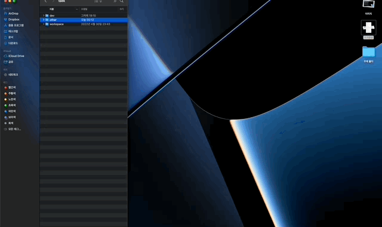

### Hiden Bar

[Hidden Bar](https://apps.apple.com/kr/app/hidden-bar/id1452453066?mt=12)는 메뉴 막대의 항목을 숨겨서 보다 메뉴 막대를 깔끔하게 만들어 주는 앱입니다.


### AppCleaner

[AppCleaner](https://freemacsoft.net/appcleaner/)는 앱 삭제 시 캐시 및 임시 파일까지 깔끔하게 같이 삭제해주는 유틸리티 앱입니다

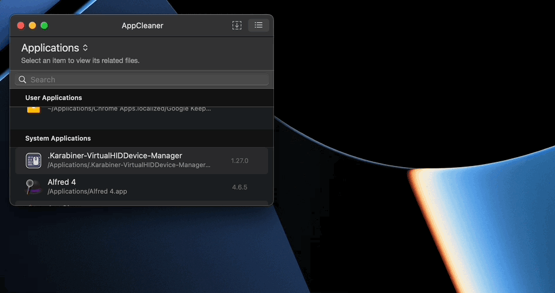

### Flow

[Flow](https://apps.apple.com/us/app/flow-focus-pomodoro-timer/id1423210932)는 뽀모도로 타이머 앱입니다. 개인적으로 뽀모도로 앱 중에 가장 깔끔하고 필요한 기능만 있다고 생각합니다.

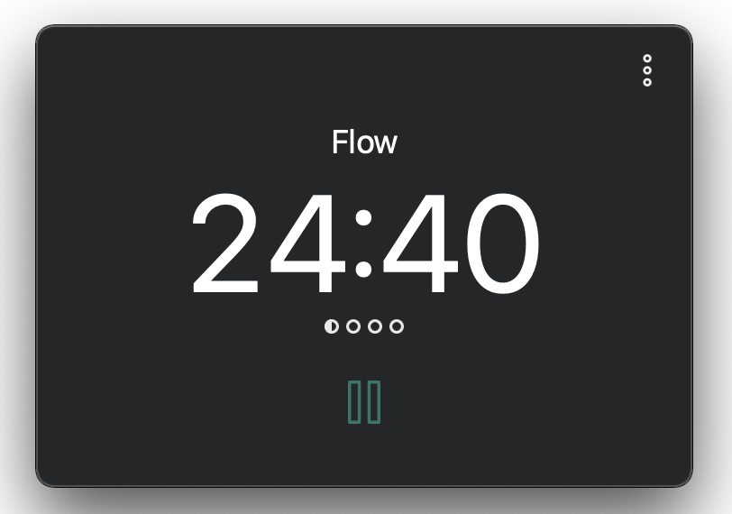


## 원화\(₩\)를 백틱\(\`\)으로 사용하기

마크다운 작성을 하거나 JS로 개발할 때 백틱\(\`\)을 많이 사용합니다. 입력 소스가 한글로 되어 있으면 백틱\(\`\) 대신 원화\(₩\)가 입력되는데 여간 불편한 게 아닙니다. `DefaultkeyBinding` 수정을 통해 원화\(₩\)를 백틱\(\`\)으로 사용할 수 있습니다.

`~/Library/KeyBindings/Defaultkeybinding.dict`에 아래 코드를 입력하세요. 

> karabiner로 설정하면 한글일 떄 vscode 터미널 토글 단축키가 작동하지 않습니다.  
> `option` + `4`로 원화(₩)를 사용할 수 있습니다.  

```bash
{
    "₩" = ("insertText:", "\`");
    "~4" = ("insertText:", "₩");
}
```

키 바인딩 관련 정보는 [여기](https://gist.github.com/trusktr/1e5e516df4e8032cbc3d)를 참고하세요.